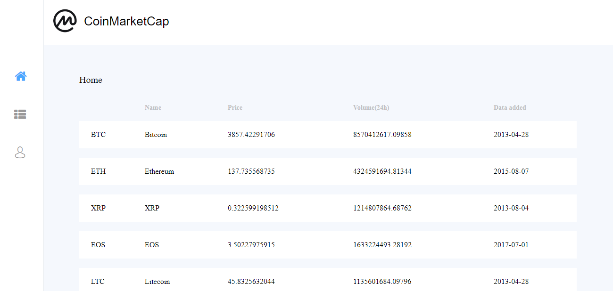
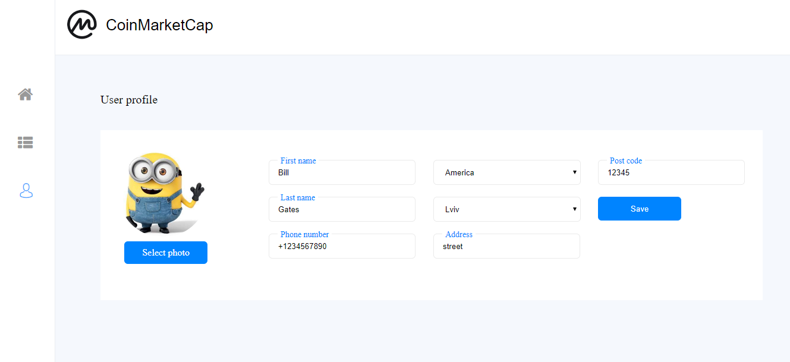
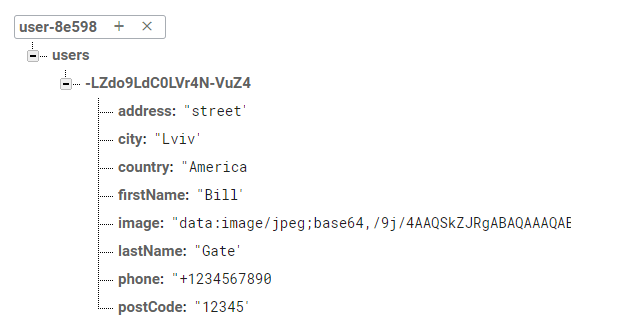

# vue-js-test-work
This application has 3 sections: 

Api request is executed through the local express server in which the CORS policy is turned off, and the local server is being asked at the front.

INSTALL 

npm i  - install
npm run dev  - to run front and server with api
npm build 

